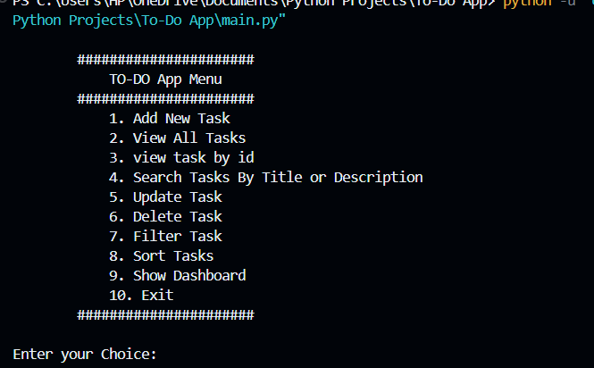
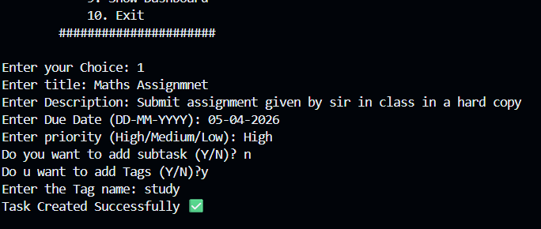
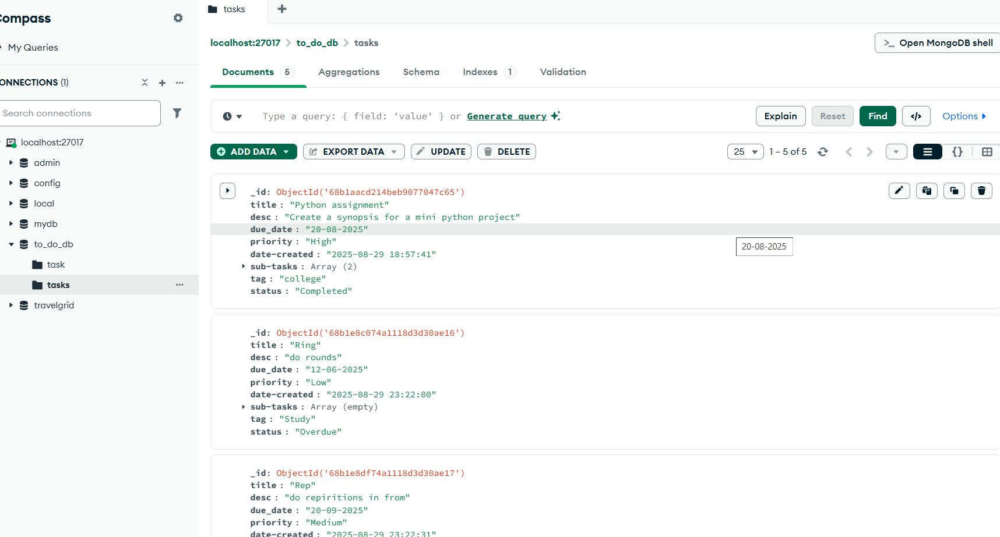

# ✅ To-Do Task Manager (CLI)

A feature-rich command-line Task Manager built with Python and MongoDB.
Goes beyond a basic to-do list — supports subtasks, priority tracking, 
overdue detection, filtering, sorting, and a statistics dashboard.

## ✨ Features

- 📝 Create tasks with title, description, due date, priority and tags
- ✅ Subtask management with completion tracking
- 🔴 Automatic overdue detection and status update
- 🔍 Search tasks by title, description, subtask or tag
- 🎯 Filter by priority, status or tag
- 📊 Sort by priority, due date or creation date
- 📈 Dashboard with task statistics breakdown
- 🗄️ Persistent storage with MongoDB

## 🛠️ Tech Stack


**Libraries:** `pymongo` `colorama` `datetime` `collections`

## 📸 Screenshots

### Main Menu


### Task Creation


### Dashboard Statistics


### MongoDB Database


## 🚀 How to Run
```bash
# Clone the repo
git clone https://github.com/Simran-775/To-Do-List.git
cd To-Do-List

# Install dependencies
pip install pymongo colorama

# Make sure MongoDB is running locally, then:
python main.py
```

## 📋 Usage

| Option | Action |
|--------|--------|
| 1 | Add new task |
| 2 | View all tasks |
| 3 | View task by ID |
| 4 | Search tasks |
| 5 | Update task |
| 6 | Delete task |
| 7 | Filter tasks |
| 8 | Sort tasks |
| 9 | Dashboard stats |
| 10 | Exit |

## 📬 Contact
Made with 💙 by [Simranjeet Kaur](https://www.linkedin.com/in/simrandadiala775/)
